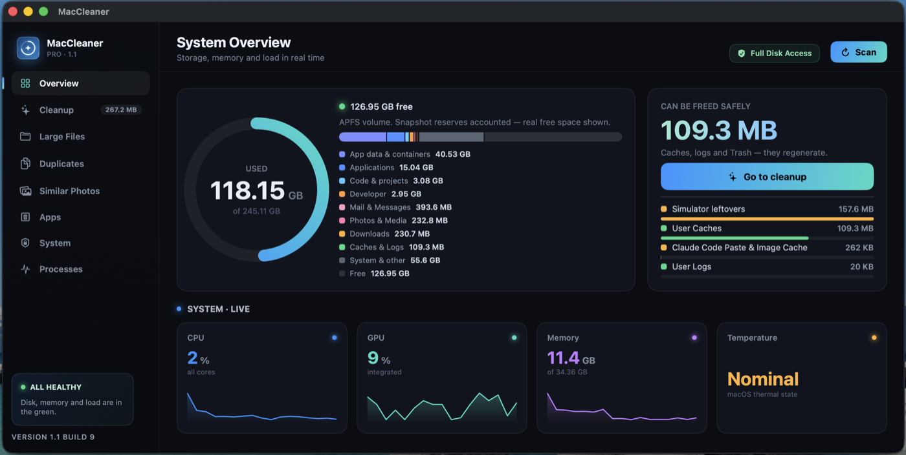
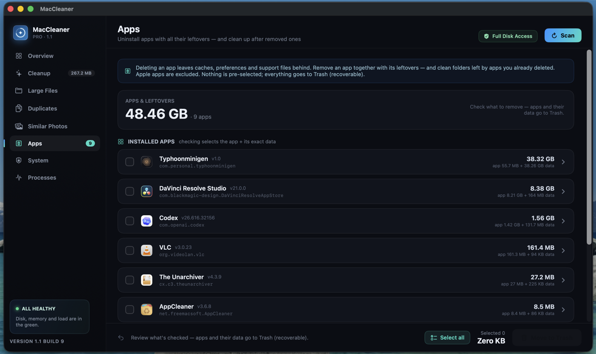
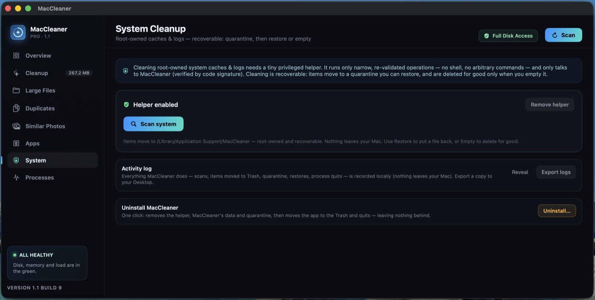
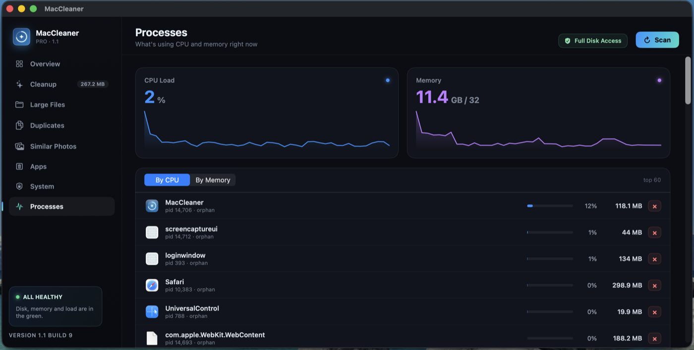

<div align="center">

# MacCleaner

**A fast, native macOS cleaner that frees space safely — and never touches your personal files.**

[](https://github.com/abgitdev/maccleaner/actions/workflows/build.yml)


Tiny footprint — the whole app is **~5.5 MB**. No Electron, no bundled runtimes, no telemetry.
100% native Swift + SwiftUI. Everything stays on your Mac.

</div>

---

## Screenshots

<table>
  <tr>
    <td width="50%" valign="top">
      <br>
      <sub><b>Overview</b> — live storage map (APFS snapshot-aware), what can be freed safely, and real-time CPU / GPU / memory / thermals.</sub>
    </td>
    <td width="50%" valign="top">
      <br>
      <sub><b>Apps</b> — uninstall apps together with every leftover, and clean up after apps you already deleted. Nothing is pre-selected.</sub>
    </td>
  </tr>
  <tr>
    <td width="50%" valign="top">
      <br>
      <sub><b>System</b> — root-owned caches &amp; logs via a tiny, code-signed privileged helper. Fully recoverable quarantine.</sub>
    </td>
    <td width="50%" valign="top">
      <br>
      <sub><b>Processes</b> — see what's using CPU and memory right now, and quit runaway processes.</sub>
    </td>
  </tr>
</table>

---

## Features

- **System Overview** — a real-time storage map that understands APFS (snapshot reserves are accounted for, so you see *real* free space), plus live CPU, GPU, memory and thermal readings.
- **Cleanup** — caches, logs and Trash that safely regenerate. Clear, honest numbers — no inflated "GBs found".
- **Large Files** — quickly surface the biggest files eating your disk.
- **Duplicates** — find and remove exact duplicate files.
- **Similar Photos** — detect near-duplicate photos so you keep the best shot.
- **Apps** — uninstall an app *with* its caches, preferences and support files, and clean folders left behind by apps you already removed. Apple apps are excluded.
- **System Cleanup** — reach root-owned caches and logs through a minimal privileged helper, with a restorable quarantine.
- **Processes** — a lightweight activity monitor to spot and stop CPU/memory hogs.

## Safety &amp; privacy

MacCleaner is built **safe by default**:

- **Nothing is pre-selected.** You choose what to remove — and everything goes to the **Trash** (recoverable), not a hard delete. No `rm -rf`, no permanent delete.
- **Personal data is protected.** Documents, Photos, Mail, Keychains and app containers are never offered for cleanup. Symlinks and protected system roots are blocked; risky areas stay report-only.
- **The privileged helper is tiny and locked down.** It runs only narrow, re-validated operations — *no shell, no arbitrary commands* — and talks **only** to MacCleaner, verified by code-signature pinning. System cleanup is recoverable: items move to a quarantine you can restore, and are deleted for good only when you empty it.
- **Everything stays local.** No analytics, no marketing, no auto-update, no network calls for your data. The activity log lives on your Mac.

## Requirements

- macOS **14 (Sonoma)** or newer
- **Apple Silicon** (M1–M4)
- **Full Disk Access** granted to the app (so it can measure and clean caches accurately)

## Build from source

MacCleaner builds with a single script — no Xcode project required.

```bash
git clone https://github.com/abgitdev/maccleaner.git
cd maccleaner/native

# The privileged helper is pinned to your Apple Developer Team ID, so signing needs it:
export TEAM_ID=XXXXXXXXXX        # your 10-char Apple Developer Team ID

./build.sh                       # compiles + signs MacCleaner.app
open build/MacCleaner.app
```

Run the safety-core test suite (no signing required):

```bash
cd native && ./test.sh
```

> **Note on signing:** the System Cleanup helper verifies the calling app by code signature (Team-ID pinning), so a working build is signed with a stable Apple Development identity. If you build with your own Team ID, set both `TEAM_ID` and the pin in `Sources/Shared/HelperProtocol.swift` to *your* Team ID.

## License

[MIT](LICENSE) © 2026 abgitdev
